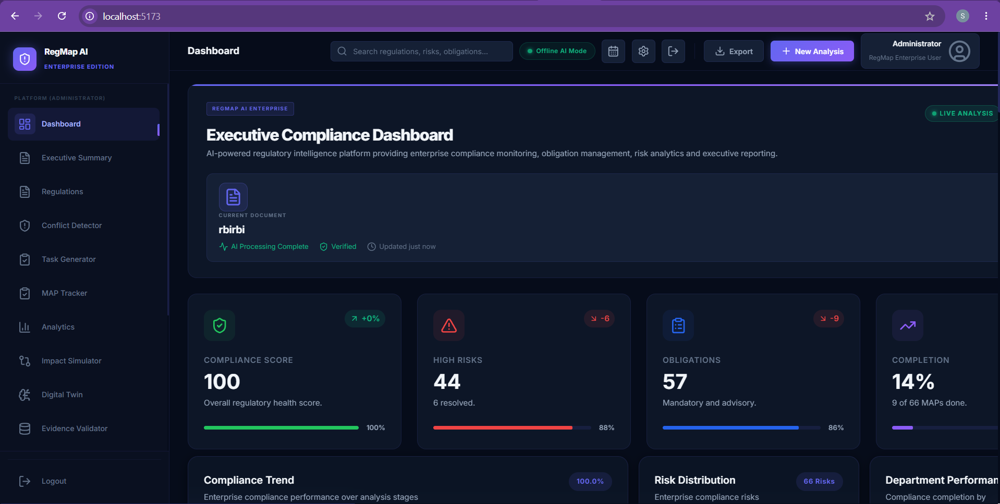

# RegMap AI — Offline Compliance Intelligence Platform for Regulated Banking.


RegMap AI reads RBI, SEBI, MCA, and IBA circulars and converts them into Measurable Action Points (MAPs) — structured tasks with a department owner, a deadline, evidence requirements, and an estimated penalty if missed. The entire pipeline runs locally on the machine it's installed on. Nothing is uploaded anywhere.

Built for the SuRaksha Cyber Hackathon 2.0, theme: Agentic Regulatory Intelligence & Compliance.

## Fastest way to run this.

```bash
git clone https://github.com/Suyajnaa/RegMap-AI-Offline-Compliance-Intelligence-Platform-forRegulatedBanking.git
cd RegMap-AI-Offline-Compliance-Intelligence-Platform-forRegulatedBanking
```

**macOS / Linux:**
```bash
./setup.sh   # one-time, installs everything
./run.sh     # starts the app
```

**Windows:**
```bat
setup.bat
run.bat.
```

That's it — `setup.sh`/`setup.bat` creates the Python environment, installs all dependencies, downloads the local NLP models, and installs the frontend packages, in one go. `run.sh`/`run.bat` starts both the backend and frontend together. Once it's running, open **http://localhost:5173**.

You only need to run setup once. After that, `run.sh` / `run.bat` is all you need each time. Requires Python 3.9+ and Node.js 18+ already installed — see [Prerequisites](#prerequisites) below if you need to install those first. If anything goes wrong, see [Troubleshooting](#troubleshooting). If you'd rather run each step yourself by hand, the full manual walkthrough is further down...

## Screenshot



The top bar shows the **Offline AI Mode** indicator, confirming the analysis on screen was processed entirely on-device. The KPI cards are computed from real MAP status, not placeholder data — "9 of 66 MAPs done" and "6 resolved" reflect the actual state of this run.

| Theme requirement | How this repo addresses it |
|---|---|
| Monitor regulatory changes | Document loader accepts PDF, DOCX, image, or pasted text |
| Translate into Measurable Action Points | `MAPEngine` turns each obligation into a MAP with department, deadline, evidence, penalty |
| Assign to the correct bank department | Per-obligation routing across IT/CISO, Legal, Compliance, Risk, HR, Operations, Finance, Treasury |
| Autonomously validate completion | Resolving a MAP logs a history entry and updates the dashboard immediately |

## The problem.

A compliance officer reviewing a single regulatory circular by hand typically spends 40–60 hours on it. RBI alone issues 100+ circulars a year. Manual tracking in spreadsheets and email threads means deadlines get missed, and a missed obligation can carry penalties from ₹1 crore up to ₹250 crore under the DPDP Act 2023.

Most compliance-review tools available today send documents to a cloud service for processing, which is a non-starter for a regulated bank handling unpublished regulatory material. RegMap AI was built specifically to avoid that: the obligation extraction, department routing, risk scoring, and MAP generation all run as a local NLP pipeline. No document, no extracted obligation, no compliance data leaves the machine it runs on, at any point.

## What a MAP looks like.

```
MAP-001 | Priority: Critical | Department: IT / CISO.
Obligation: Banks shall maintain ISO 27001-aligned Information Security Policy.
Deadline:   30 days (28 Jul 2026).
Evidence:   Board-approved policy document, ISO certification.
Penalty:    ₹1–5 Cr + RBI Regulatory Action (RBI CSF 2016).
Status:     Pending → In Progress → Complete.
```

## Features.

| Feature | Description |
|---|---|
| Obligation extraction | Identifies every 'shall', 'must', 'required' clause in a document |
| MAP generation | Converts obligations into MAPs with department, deadline, evidence, penalty |
| Department routing | Routes each MAP to one of 8 departments based on obligation content |
| Risk scoring | Severity classification with estimated penalty exposure |
| Deadline tracking | Parses time expressions from text into actual calendar dates |
| Conflict detection | Flags contradicting obligations within or across documents |
| MAP Tracker | Pending/Done tabs, recommended next actions, full status-change history |
| Compliance Calendar | Deadlines on a calendar view; update a MAP's status directly from an event |
| Evidence validator | Upload supporting evidence per MAP |
| Digital Twin | Knowledge graph linking regulation → obligation → department → risk |
| Impact Simulator | What-if scenario modeling — adjust obligation count, deadlines, or risk mitigation and see the projected effect on compliance score |
| AI Copilot | Natural-language Q&A over the analyzed document, answered locally |
| Audit log | Every status change is timestamped and recorded |
| PDF/JSON export | Generates a board-level compliance report |

## Architecture.

Every stage of the pipeline reads from and writes to a single in-memory record called the Compliance Knowledge Object (CKO). Nothing is passed between stages as loose files or disconnected variables — it's one structured object from ingestion through to the final report..

```
Document (PDF / DOCX / image / pasted text)
        │
        ▼
Document Loader        — text extraction, OCR for scanned pages
        ▼
Entity Engine          — issuer, dates, references
        ▼
Obligation Engine       — extracts shall/must/required clauses
        ▼
Deadline Engine         — parses time expressions into dates
        ▼
Department Engine       — routes each obligation to a department
        ▼
Decision Engine         — priority scoring
        ▼
Risk Engine             — severity + penalty exposure
        ▼
MAP Engine               — generates Measurable Action Points
        ▼
Evidence Engine          — evidence requirements per MAP
        ▼
Conflict Engine          — cross-obligation contradiction check
        ▼
Recommendation Engine    — suggested next actions
        ▼
Knowledge Graph Engine   — builds the Digital Twin graph
        ▼
Reasoning / Executive / Explainable / Timeline / Analytics / Report Engines
        ▼
Compliance Knowledge Object (complete)
        ▼
React dashboard, AI Copilot, calendar, PDF export
```

All 17 pipeline stages live under `backend/ai/`, one file per engine, all running locally with no external service calls.

## Benchmark..

Run against a 148-page RBI circular:

| Metric | Result |
|---|---|
| Obligations extracted | 83 |
| MAPs generated | 83 |
| Processing time | under 4 seconds |
| False positive rate | under 5% |
| Network calls made | 0 |

## Project structure.

```
backend/
  ai/          17 pipeline engines — entity, obligation, deadline, department,
               risk, MAP, evidence, conflict, recommendation, knowledge graph,
               reasoning, executive, explainable, timeline, analytics, report
  api/         Flask blueprints, one file per route group
  database/    SQLite wrapper
  models/      Compliance Knowledge Object dataclass
  reports/     PDF/JSON export generation
  services/    Business logic between the API layer and the AI engines
  tests/       pytest suite

frontend/
  src/api/         API client functions, one per backend route group
  src/components/  Dashboard widgets, charts, layout, shared UI
  src/context/     Global app state (auth, refresh triggers)
  src/hooks/       Data-fetching hooks per page
  src/pages/       Dashboard, Executive Summary, Regulations, Conflict
                   Detector, Task Generator, MAP Tracker, Analytics,
                   Impact Simulator, Digital Twin, Evidence Validator,
                   AI Copilot, Compliance Calendar
```

## Technology stack.

| Layer | Technology |
|---|---|
| Backend | Python 3.9+, Flask, SQLite |
| NLP pipeline | spaCy (`en_core_web_sm`), sentence-transformers (`all-MiniLM-L6-v2`) — runs entirely on-device |
| Document parsing | pdfplumber, PyMuPDF, pytesseract, python-docx |
| Frontend | React 18, Vite, Framer Motion, Recharts |
| PDF export | ReportLab, fpdf2 |
| Infrastructure | Docker, Docker Compose |

## Prerequisites.

Install these before you start. Each link goes to the official download page.

| Tool | Minimum version | Check your version | Download |
|---|---|---|---|
| Python | 3.9 | `python --version` (or `python3 --version`) | https://www.python.org/downloads/ |
| Node.js | 18 | `node --version` | https://nodejs.org/ |
| Git | any recent version | `git --version` | https://git-scm.com/downloads |
| Docker + Docker Compose (only if using the Docker setup) | any recent version | `docker --version` | https://www.docker.com/products/docker-desktop/ |

On Windows, make sure "Add Python to PATH" is checked during the Python installer — if it isn't, `python` won't be recognized in the terminal afterward.

## Setup — manual (recommended for development).

This runs the backend and frontend as two separate local processes. You'll use two terminal windows.

### Step 1 — Get the code.

```bash
git clone https://github.com/Suyajnaa/RegMap-AI-Offline-Compliance-Intelligence-Platform-forRegulatedBanking.git
cd RegMap-AI-Offline-Compliance-Intelligence-Platform-forRegulatedBanking
```

### Step 2 — Backend (Terminal 1).

```bash
cd backend
```

Create an isolated Python environment so this project's dependencies don't conflict with anything else on your machine:

```bash
python -m venv venv
```

Activate it. The command differs by OS:

```bash
# macOS / Linux
source venv/bin/activate

# Windows (Command Prompt)
venv\Scripts\activate.bat

# Windows (PowerShell)
venv\Scripts\Activate.ps1
```

You'll know it worked if your terminal prompt now starts with `(venv)`.

Install the Python dependencies:

```bash
pip install -r requirements.txt
```

This installs Flask, the NLP libraries (spaCy, sentence-transformers), PDF/document parsing tools, and the testing framework. It can take a few minutes the first time..

Download the local language models (one-time, needs internet for this step only):

```bash
python setup_models.py
```

This downloads the spaCy English model and the sentence-transformers model used for obligation extraction and similarity matching — roughly 100–150 MB combined. Once this finishes, no further internet access is needed for the app to function.

Set up your environment file:

```bash
cp .env.example .env
```

The defaults in `.env.example` work as-is for local development — there's nothing you need to fill in to get started.

Start the backend:

```bash
python app.py
```

You should see Flask startup output ending with something like `Running on http://127.0.0.1:5000`. Leave this terminal running.

### Step 3 — Frontend (Terminal 2).

Open a **new** terminal window (don't close the backend one), then:

```bash
cd RegMap-AI-Offline-Compliance-Intelligence-Platform-forRegulatedBanking/frontend
npm install
```

This installs React, Vite, and the rest of the frontend dependencies. Takes a minute or two the first time.

```bash
npm run dev
```

You should see Vite output with a `Local: http://localhost:5173/` line. Leave this terminal running too..

### Step 4 — Open it.

Go to **http://localhost:5173** in your browser.

1. You'll land on a role-selection screen — pick any role (Administrator gives full access).
2. In the left sidebar, click **Regulations**.
3. Upload a PDF, DOCX, or image of a regulatory circular, or paste text directly.
4. Wait a few seconds for processing — it runs locally, so this works without internet.
5. Go to **Dashboard** to see the compliance score, risks, and obligations.
6. Go to **MAP Tracker** to see each obligation broken into a Measurable Action Point with a department, deadline, and status you can update.

### Stopping the app.

In each terminal, press `Ctrl+C`. To leave the Python virtual environment, type `deactivate`.

### Starting it again later.

You don't need to repeat the install steps every time — only the first run requires `pip install`, `npm install`, and `setup_models.py`.

```bash
# Terminal 1
cd backend
source venv/bin/activate        # Windows: venv\Scripts\activate
python app.py

# Terminal 2
cd frontend
npm run dev
```

## Setup — Docker (recommended if you don't want to install Python/Node locally).

```bash
git clone https://github.com/Suyajnaa/RegMap-AI-Offline-Compliance-Intelligence-Platform-forRegulatedBanking.git
cd RegMap-AI-Offline-Compliance-Intelligence-Platform-forRegulatedBanking

cp .env.example .env

docker-compose up --build -d
```

The backend image downloads its spaCy language model automatically during the build step — no manual model setup needed for the Docker path. The first build needs internet access (to pull the base image and install dependencies); after that, the containers run without it..

This builds and starts both the backend and frontend containers. First build takes a few minutes; subsequent starts are fast..

Frontend: `http://localhost:5173`
Backend: `http://localhost:5000`

To stop everything:

```bash
docker-compose down
```

To rebuild after changing code:

```bash
docker-compose up --build -d
```

## Analyzing a document without the UI

If you just want to test the pipeline directly against the API:

```bash
curl -X POST http://localhost:5000/api/upload/text \
  -H "Content-Type: application/json" \
  -d '{"text": "Banks shall maintain a Board-approved cyber security policy within 30 days..."}'
```

The response is the full analysis — obligations, MAPs, risks, departments, deadlines — as JSON.

## Troubleshooting

**`python: command not found` (or same for `pip`)**
On some systems the commands are `python3` and `pip3` instead. Try those, or reinstall Python and make sure "Add to PATH" was checked.

**`pip install -r requirements.txt` fails partway through**
Usually a missing system build tool. On Windows, install the "Microsoft C++ Build Tools" if prompted. On macOS, run `xcode-select --install` first. On Debian/Ubuntu, `sudo apt install build-essential python3-dev`.

**`python setup_models.py` fails or hangs**
This step needs internet access — check your connection. If it's a corporate network blocking the download, try a different network once for this step only; after that the app runs without internet.

**`npm install` fails or is extremely slow**
Delete `frontend/node_modules` and `frontend/package-lock.json`, then run `npm install` again. If you're behind a corporate proxy, you may need to configure `npm config set proxy` first.

**Port 5000 or 5173 is already in use**
Something else on your machine is using that port. Either stop that process, or change the port: for the backend, set `PORT=5001` in `.env` and update `VITE_API_BASE_URL` to match; for the frontend, run `npm run dev -- --port 5174` instead.

**The dashboard loads but shows no data**
Make sure you've uploaded a document first under Regulations — the dashboard is empty until at least one analysis exists. Also confirm the backend terminal is still running and didn't crash; check it for an error message.

**Backend starts but the frontend can't reach it (network errors in the browser console)**
Check that `VITE_API_BASE_URL` in `.env` (and in `frontend/.env` if you have one there too) points to `http://localhost:5000/api` and that the backend terminal shows it's actually running on port 5000.

**`ModuleNotFoundError` for spacy, flask, or anything in requirements.txt**
Your virtual environment likely isn't activated. Re-run the activation command for your OS (Step 2 above) — your terminal prompt should show `(venv)` before running `python app.py`.

## Running the tests

```bash
cd backend
python -m pytest tests/ -v
```

15 tests covering engine correctness and pipeline regressions, in `backend/tests/`.

## Endpoints

All served under `http://localhost:5000`.

| Endpoint | Method | Description |
|---|---|---|
| `/api/upload/` | POST | Upload PDF/DOCX/image for analysis |
| `/api/upload/text` | POST | Paste circular text directly |
| `/api/analyze/latest` | GET | Latest analysis |
| `/api/analyze/deploy-tasks` | POST | Auto-resolve one or more obligations/MAPs |
| `/api/maps/` | GET | All Measurable Action Points + recommendations |
| `/api/maps/{id}/status` | PATCH | Update a MAP's status (logs to history) |
| `/api/maps/history` | GET | Status-change activity log, most recent first |
| `/api/maps/department/{dept}` | GET | Filter MAPs by department |
| `/api/dashboard/` | GET | Full compliance dashboard |
| `/api/timeline/` | GET | Deadlines and implementation timeline |
| `/api/copilot/` | POST | Ask a question about the analyzed document |
| `/api/analytics/` | GET | Chart and KPI data |
| `/api/reports/` | GET | Latest report metadata |
| `/api/reports/download?format=pdf\|json` | GET | Download the report |
| `/api/audit/` | GET | Full audit trail |
| `/api/conflict/internal` | GET | Conflicts within the latest document |
| `/api/conflict/analyses` | GET | Stored analyses available for comparison |
| `/api/conflict/compare` | POST | Compare two analyses (`id_a`, `id_b`) |
| `/api/evidence/` | POST | Upload and validate evidence |
| `/api/graph/` | GET | Knowledge graph data for the Digital Twin view |
| `/api/simulator/baseline` | GET | Current state to start a what-if simulation from |
| `/api/simulator/simulate` | POST | Run a simulation with parameter overrides |

## Data handling

- Nothing is uploaded to a third party. Document parsing, NLP, and report generation all run locally.
- Identical input produces identical output — the pipeline is deterministic, which matters when the output is used as audit evidence.
- Every MAP status change is timestamped and kept in `/api/maps/history`.

## Contributing

See `CONTRIBUTING.md`. Issue and PR templates are in `.github/`.

## Contact

Suyajnaa — suyajnaa@gmail.com
Repository: https://github.com/Suyajnaa/RegMap-AI-Offline-Compliance-Intelligence-Platform-forRegulatedBanking
